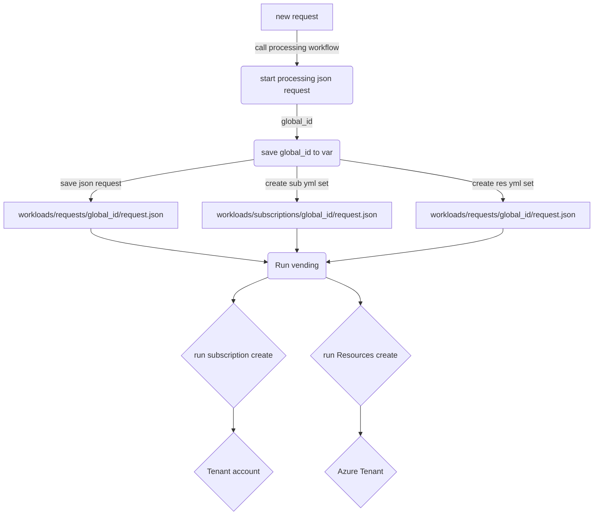

# flowchart

```mermaid
flowchart TD
    A[new request] -->|call processing workflow| B(start processing json request)
    B -->| global_id| C(save global_id to var)
        C -->|save json request| D[workloads/requests/global_id/request.json] --> G(Run vending)
        C -->|create sub yml set| E[workloads/subscriptions/global_id/request.json] --> G(Run vending)
        C -->|create res yml set| F[workloads/requests/global_id/request.json] --> G(Run vending)
    G --> H{run subscription create}-->I{Tenant account}
    G --> J{run Resources create}-->K{Azure Tenant}
```